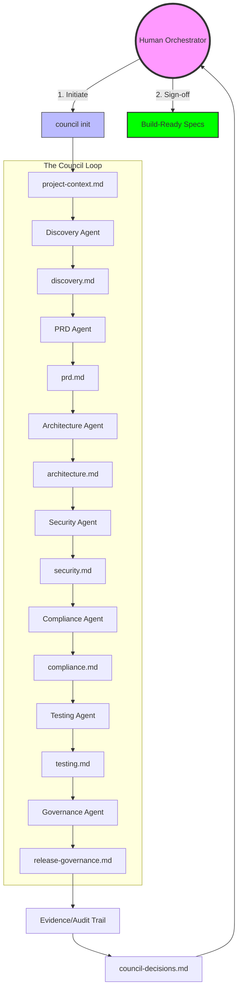
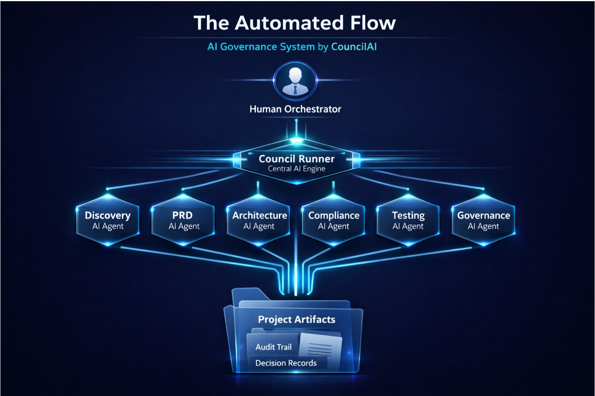

# CouncilAI – AI-Driven SDLC Meta-System

[](https://opensource.org/licenses/MIT)
[](https://www.python.org/downloads/)
[](https://codespaces.new/ai-solopreneur/councilai)
[](#)
[](#)
[](#)
[](#)

## Overview
CouncilAI is a governance-first, compliance-aware, multi-agent AI system designed
to execute the full Software Development Lifecycle (SDLC) with enterprise-grade rigor.

This is not a code generator.  
This is not autonomous AI.

CouncilAI is an **AI operating model** that enables humans to **orchestrate AI agents safely, transparently, and with full accountability**.

It enforces:
- Human-in-the-loop decision making
- Behavioral safety constraints for AI agents
- Regulatory and compliance readiness
- Auditability and traceability by design

👉 **See it in action**:
- 🚜 **[My Bottle Showcase](showcase/my-bottle/README.md)**: A simple SaaS transformation.
- 🏥 **[Telehealth Bot Showcase](showcase/telehealth-bot/README.md)**: Rigorous governance for regulated HealthTech.
- 💸 **[Rural Micro-lending](showcase/rural-micro-lending/README.md)**: FinTech KYC & Risk governance.
- 🍏 **[Children's EdTech](showcase/children-privacy-edtech/README.md)**: Heavy COPPA/Privacy compliance.
- 📊 **[Modern SaaS CRM](showcase/saas-crm/README.md)**: Standard multi-tenant SaaS.

---

## 🚀 Quick Start (Installation)

> **One-Click Setup**: You can run this project immediately in your browser using GitHub Codespaces.
> [](https://codespaces.new/ai-solopreneur/councilai)


To get started with CouncilAI, you need to set up the execution runner.

### 1. Set Up Environment
```bash
# Clone the repository
git clone https://github.com/ai-solopreneur/councilai.git
cd councilai

# Create and activate a virtual environment
python3 -m venv test_env
source test_env/bin/activate

# Install the runner in editable mode
pip install -e runner/
```

### 2. Configure LLM
Create a `.env` file in the `runner/` directory with your API keys.
```bash
cp runner/.env.example runner/.env
```
Edit `runner/.env` and add your keys:
```env
# Choose: "openai" or "anthropic"
COUNCIL_LLM_PROVIDER=openai

# If using OpenAI
OPENAI_API_KEY=sk-...

# If using Anthropic
ANTHROPIC_API_KEY=sk-ant-...
```

### 3. Initialize Your Project
CouncilAI can generate a professional product declaration from a simple idea:
```bash
# Initialize a new project context
council init "Marketplace for locally sourced vegetables" --project fresh-market
```

### 4. Run the Full Lifecycle
Execute every agent from Discovery to Release Governance in one shot:
```bash
# Run all agents in sequence
council all --project fresh-market

# Run ONLY the security threat model
council security --project fresh-market
```

### 3-Minute Walkthrough

1.  **Initialize**: `council init "A fitness app for seniors" --project senior-fit`
    - Creates `projects/senior-fit/project-context.md`.
2.  **Execute**: `council all --project senior-fit`
    - Runs all 6 agents in sequence. Each agent produces a signed artifact in the project folder.
3.  **Audit**: Review `projects/senior-fit/release-governance.md` for any compliance or architecture red flags.
4.  **Sign-off**: Human orchestrator signs `projects/senior-fit/council-decisions.md` to move to the build phase.

For detailed agent-by-agent control and technical setup, see the [Runner Documentation](runner/README.md).

---

## Core Principles
- **Single-Responsibility AI Agents**: Each agent does one thing well.
- **Humans as Orchestrators**: Humans approve high-stakes decisions.
- **Safety Over Speed**: Rigorous validation at every stage.
- **Human Oversight by Default**: No autonomous releases.
- **Evidence-Based Decisions**: Every choice is backed by an artifact.
- **Compliance-First**: Regulatory needs are identified early.
- **Test-Driven Validation**: Proof of correctness is required.

---

## System Components

### Agents
CouncilAI is composed of specialized AI agents:
- **Discovery Agent**: Maps stakeholders, goals, and initial risks.
- **PRD Agent**: Translates vision into functional requirements.
- **Architecture Agent**: Designs the system and identifies technical tradeoffs.
- **Security Agent**: Conducts STRIDE threat modeling and OWASP vulnerability mapping.
- **Compliance Agent**: Maps requirements to regulatory controls.
- **Testing Agent**: Creates strategy and traceability for verification.
- **Release & Governance Agent**: Audits the entire trail before final sign-off.

---

## 🏗 Technical Architecture

CouncilAI uses a state-machine inspired artifact flow. Each agent is a specialized transformer that consumes the output of its predecessor.




---

## How Agents Build on Each Other

CouncilAI agents execute in a **linear, artifact-driven flow**. Each agent reads approved artifacts from previous steps and produces a new artifact that becomes input for the next agent.

### The Automated Flow
The `council all` command automates this sequence while maintaining human-in-the-loop safety:



1. **Explicit Declaration** — CouncilAI doesn't guess. You declare your intent in `project-context.md` (via `council init`) and the system enforces it.

2. **Artifacts Are Truth** — Agents only read approved, versioned artifacts. No hidden state.

3. **Fail-Fast Governance** — The `run-all` command will halt immediately if any agent fails or a compliance gate is blocked.

4. **Human Final Authority** — Automation generates *proposals*. Production readiness requires a human to sign the `council-decisions.md` audit record.

---

## 🚀 Integration: Using with AI Coding Agents

CouncilAI is the **Architect**. Coding Agents (Cursor, Windsurf, Devin, etc.) are the **Builders**.

1.  **Generate Specs**: Run CouncilAI to create your `prd.md`, `architecture.md`, and `compliance.md`.
2.  **Handoff**: Attach your `projects/<name>/` folder as context for your coding agent.
3.  **Build**: Tell your coding agent to follow the artifacts strictly.

See the **[AI Agent Handoff Guide](docs/agent-handoff.md)** for the Master Prompt template.

---

## Execution Model
CouncilAI provides a flexible execution layers:

1. **Protocol (The Spec)**: The markdown agents in `agents/`.
2. **Runner (The CLI)**: The `council` utility that executes agents via LLMs.
3. **CI/CD (The Gates)**: Automated testing via GitHub Actions.

See [START_HERE.md](START_HERE.md) for the onboarding journey.

---

## What This Repository Is (and Is Not)

**CouncilAI is NOT:**
- A code generator
- A chatbot workflow
- A replacement for engineers
- An uncontrolled autonomous agent system

**CouncilAI IS:**
- A governance layer for AI-driven development
- A compliance-first SDLC operating system
- A trust framework for agentic software development
- A foundation for regulated, enterprise-grade systems

---

## Who Should Use This
- Solo founders building serious AI products
- AI-first startups preparing for enterprise adoption
- Enterprise innovation teams
- Regulated industries (FinTech, HealthTech, GovTech)

### 🚩 Who This Is NOT For
- **Autonomous Coders**: If you want a bot that writes and deploys code without you looking at it, CouncilAI is the wrong tool.
- **Trivial Projects**: Simple scripts or personal blogs don't need this level of governance.
- **Speed-Only Teams**: If you view documentation and compliance as "blockers" rather than "safety features," CouncilAI will feel too slow for you.

---

## What Makes CouncilAI Different
CouncilAI governs **decision-making**, not just task execution.

It:
- Treats AI output as advisory, not authoritative
- Preserves human accountability
- Prevents unsafe autonomy by design
- Creates a durable audit trail for AI-driven development

CouncilAI is not an AI assistant.  
It is an **AI governance system**.

---

## Roadmap
- Execution Runner (CLI)
- Compliance & Safety CI/CD Gates
- Council Dashboard
- Security Agent (STRIDE / SAST / Supply Chain)
- Enterprise Policy Packs

---

## Status
CouncilAI is currently in **Protocol v1.0 (Specification Complete)**.

Execution tooling is intentionally decoupled from governance to preserve trust,
auditability, and correctness.

---

## License & Usage
This repository represents a reusable AI-driven SDLC framework.

Licensing, commercialization, and execution layers can be added without modifying
the core governance model.
